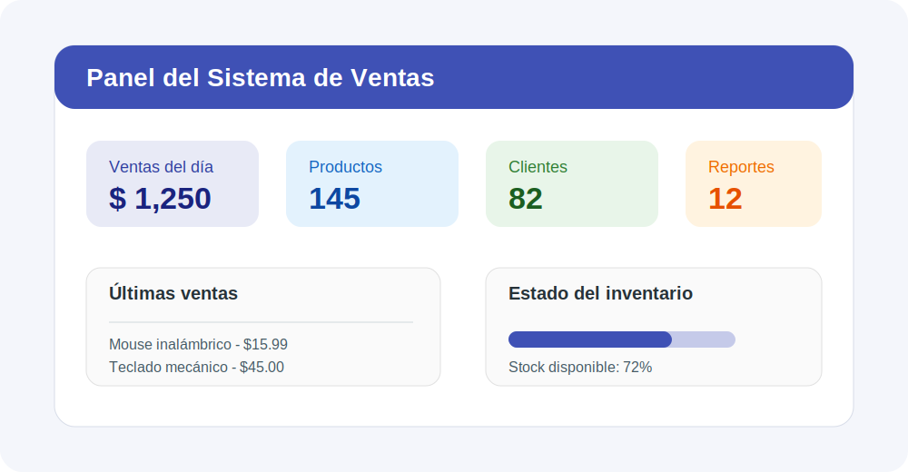

# Sistema de Ventas Simple

El **Sistema de Ventas Simple** es una aplicación básica diseñada para registrar productos, clientes y ventas de una pequeña empresa o negocio.

Este sitio documenta el funcionamiento general del sistema, su instalación y el flujo básico de uso.

!!! note "Objetivo del sistema"
    Facilitar el control de productos, ventas y clientes mediante una solución sencilla y organizada.

## Funcionalidades principales

| Módulo | Descripción |
| ------ | ----------- |
| Productos | Permite registrar, consultar y actualizar productos. |
| Clientes | Guarda información básica de los clientes. |
| Ventas | Registra las ventas realizadas. |
| Reportes | Muestra resúmenes de ventas y productos vendidos. |

## ¿Para qué sirve?

Este sistema puede utilizarse como base para pequeños negocios que necesitan llevar un control inicial de sus operaciones de venta.

## Navegación interna

Puedes continuar con la sección de [Instalación](instalacion.md) para preparar el entorno del proyecto.

También puedes revisar directamente la página de [Uso del sistema](uso.md).